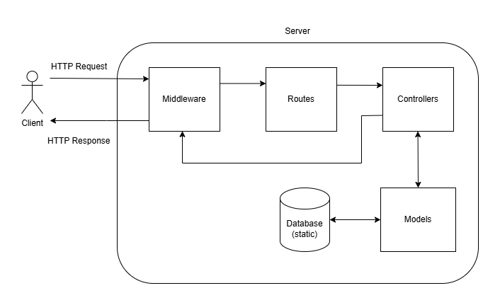

# GovTech SWE Take Home Assignment
## Set-Up Instructions
1. Install dependencies with `npm install`.
2. Start the server with `npm run dev`. The server will run on port 8000 unless otherwise specified in a .env file, e.g. `PORT=8080`.
3. Visit <http://localhost:port/users> to view the application.
4. Requests can be tested using the .REST files located in the 'Requests' folder using port 8000.

## Additional Notes
### Assumptions Made
#### GET Request
- Each optional parameter should meet the additional following criteria to be a valid request:
    - `min` and `max` must be >=0.
    - `offset` must be >=0.
    - `limit` must be >=1.
- `offset` is applied only after applying `min` and `max` restrictions.
#### POST Request
- The expected content in the `file` field is a CSV string since its content-type is `application/x-www-form-urlencoded`.
- The CSV string is delimited by `,` and rows are separated by `\n`.
- Leading and/or trailing whitespaces do not affect the validity of a row. For example, both `Amy , 3000 ` and `Amy,3000` are considered valid rows.
- Names must contain only alphabetical characters (or spaces) to be considered valid.

### Basic Architectural Diagram
